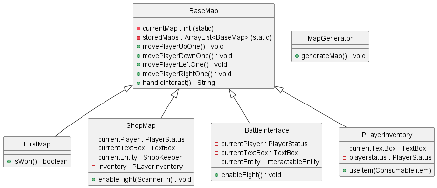
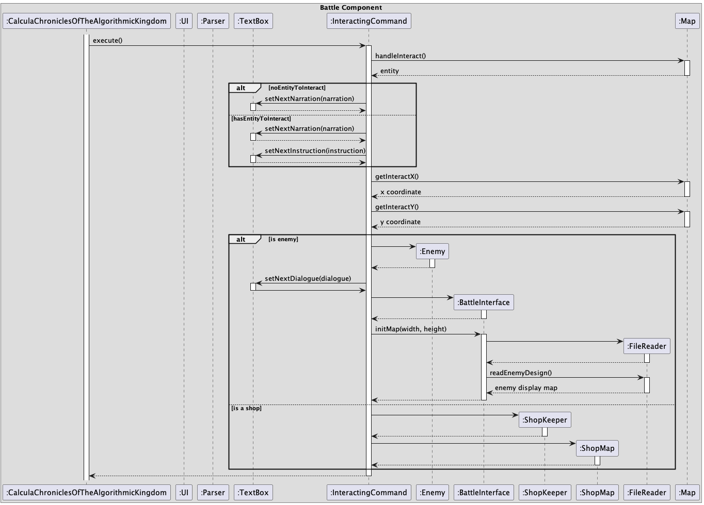
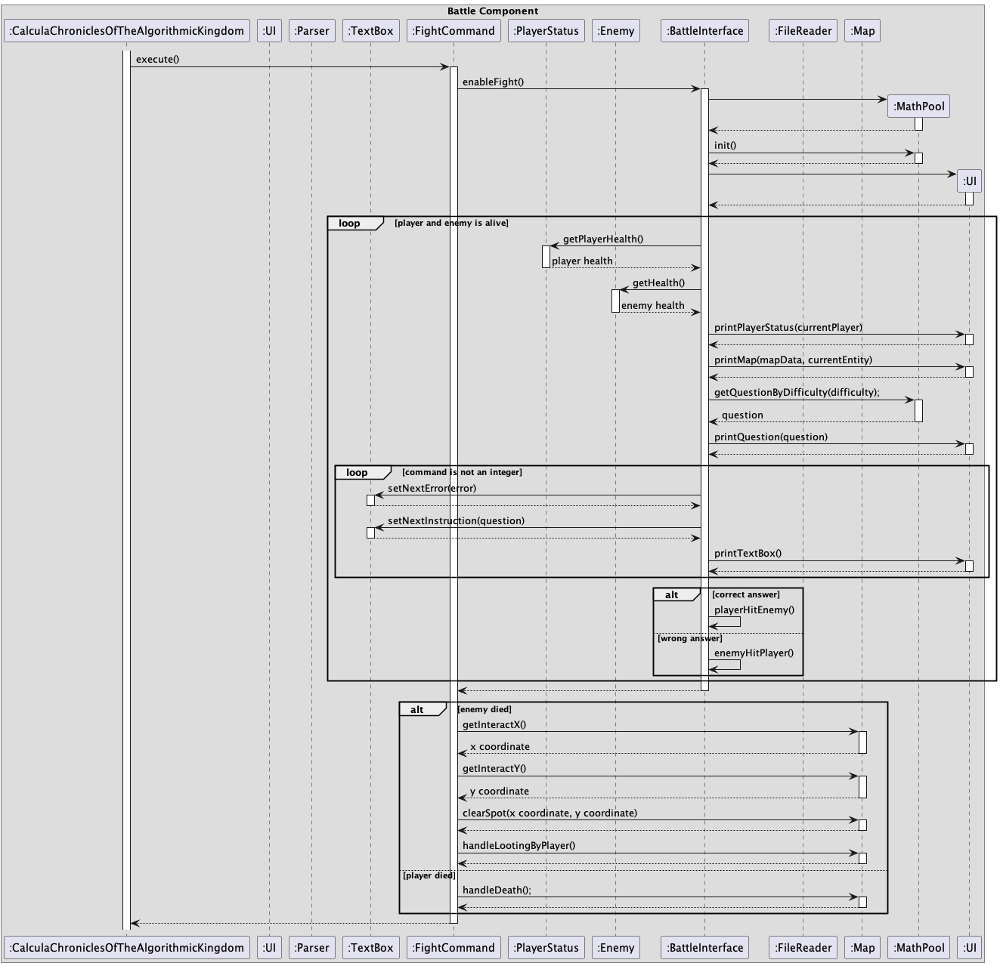

# Developer Guide

## Acknowledgements

{list here sources of all reused/adapted ideas, code, documentation, and third-party libraries -- include links to the original source as well}

## Design & implementation

### Architecture

### UI Component

# UserCommand feature

User can type command to do things on the Map. 

If the user type the command, `parseCommand` function will be called. After that, the original input will be
analyzed by `analyseCommand` function to see if it matches a kind of `CommandType`. Then, we will return new
Command back to the main based on the command type. The Final step is to call the `execute` function. If the command
is the type of `fightCommand`, we will call the execute function with one parameter `Scanner`. For all other
conditions, we will call the execute function with no parameter.


### Map Component

The API of this component is defined in BaseMap.java.

Each map instance consists of a `currentMap` which stores a 2-dimensional array of characters which represents the 
printed map for the player. All maps will come with a given `height` and `width`, all of these attributes are inherited
from the AMap abstract class. Currently, the `FirstMap` and `BattleInterface` classes
extend AMap. `FirstMap` is the first map displayed upon entering the game and it displays the position of the player. 
The `BattleInterface` is the map displayed when the player interacts with an `interactable`. The following image
shows the architecture of the Map component



At the moment the `MapGenerator` class allows the positions of enemies to be placed randomly throughout instances of
`FirstMap` only. 

The reason why the player's map(FirstMap), the shop's interface and the battle interface all extend off of the `BaseMap`
class is because during the game loop, these maps are being cycled through as the main screen the user will view.


{Describe the design and implementation of the product. Use UML diagrams and short code snippets where applicable.}

### Interacting with Environment Component

The API of this component is defined in InteractingCommand.java



This component happens when the user chooses to key the interact command. <br>
Here is how it works:
1.  When the command is passed by the user, the ```CalculaChroniclesOfTheAlgorithmicKingdom``` object calls the ```Parser``` object
    to parse the command to call the respective commands. Here, the ```InteractingCommand``` object is created.
2. The ```CalculaChroniclesOfTheAlgorithmicKingdom``` component then calls the execute() method in ```InteractingCommand```.
3. It executes the method and creates other objects like ```Enemy``` and ```ShopKeaper``` components which are responsible for the 
entity classes in the game and also ```BattleInterface``` and ```ShopMap``` which are responsible for displaying these entities among other things.
4. The ```BattleInterface``` or ```ShopKeeper``` will then read from a .txt file to store their displays by creating the ```FileReader``` object and 
running their respective methods.
5. These displays, textboxes and player status will then be subsequently printed by the ```CalculaChroniclesOfTheAlgorithmicKingdom``` object.

### Battling Component

The API of this component is defined in FightCommand.java.



This component happens when the user chooses to fight an enemy. <br>
Here is how it works:
1.  When the user chooses to fight, the ```CalculaChroniclesOfTheAlgorithmicKingdom``` object calls the ```Parser``` object
    to parse the command to call the respective commands. Here, the ```FightCommand``` object is created.
2. The ```CalculaChroniclesOfTheAlgorithmicKingdom``` object then calls the execute() method in ```FightCommand``` and enables the fighting.
3. The ```MathPool``` object is created, which is responsible for the math questions to answer and another ```Ui``` object is created to interact with the user.
4. In the enableFight() method, it has a loop which asks the user math questions to answer until the player or enemy dies. The player takes damage for 
every wrong answer and deals damage to the enemy for every correct answer.
5. In this loop, there is another loop to parse the answer given by the user, and displays an error message  and the same math question
until the user gives an answer which is a valid integer.
6. Once either the player or enemy dies, it then exits and runs the relevant checks to eventually print the output to be shown to 
the user after battle, handled by ```CalculaChroniclesOfTheAlgorithmicKingdom```.

## Product scope
### Target user profile

{Describe the target user profile}

### Value proposition

{Describe the value proposition: what problem does it solve?}

## User Stories

| Version | As a ... | I want to ...             | So that I can ...                                           |
|---------|----------|---------------------------|-------------------------------------------------------------|
| v1.0    | new user | see usage instructions    | refer to them when I forget how to use the application      |
| v2.0    | user     | find a to-do item by name | locate a to-do without having to go through the entire list |

## Non-Functional Requirements

{Give non-functional requirements}

## Glossary

* *glossary item* - Definition

## Instructions for manual testing

{Give instructions on how to do a manual product testing e.g., how to load sample data to be used for testing}
